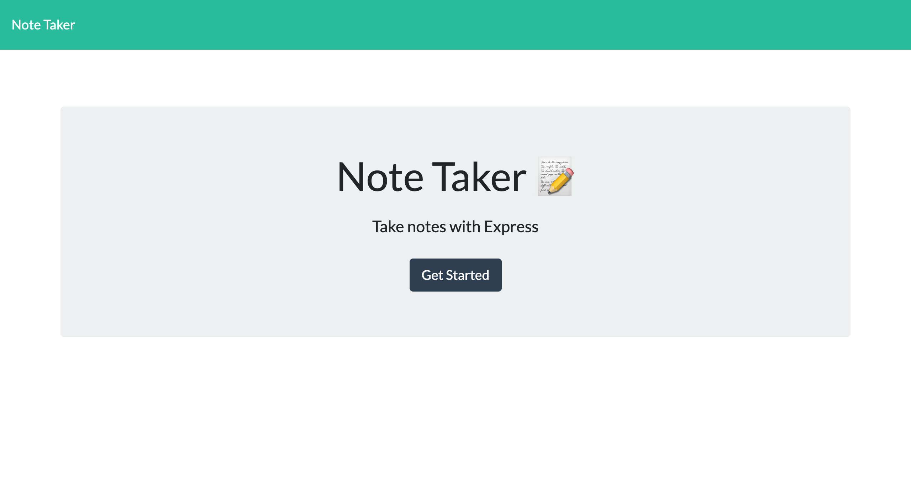
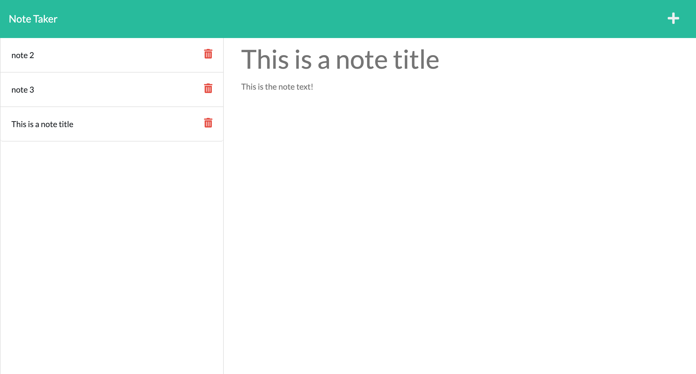

# tays-note-taker

## Description

This application was developed to provide a simple yet effective way of recording notes throughout the day. The application allows users to quickly create new notes and save them to an organized list on the left hand side of the screen. Notes can be deleted by the click of a button.

## Installation

To use this application, navigate to https://github.com/tguy5837/tays-note-taker and you will be able to use it!

## Usage

When navigated to the application website, you will see a landing page with a button to begin. Once that button is clicked, a new HTML page is displayed which is the main note taking page. To begin taking a note, click the plus sign at the top right hand corner and then add a note title and note text. Once the two fields contain text, a save button will appear at the top right hand corner of the page. When clicked your note will be saved to the server! If you would like to delete a note, click the red trashcan button to the right of the specified note and it will be deleted.

### Photos

## Questions

### How to reach me:

GitHub: [tguy5837](https://github.com/tguy5837)

Email: [tguy5837@gmail.com](mailto:tguy5837@gmail.com)
